# pemrograman_mobile

A new Flutter project.

# Aplikasi Manajer Pengeluaran Pribadi

Aplikasi ini membantu pengguna dalam **mengelola pengeluaran harian** dengan mudah dan efisien.  
Tersedia berbagai fitur seperti pencatatan pengeluaran, pengelompokan kategori, serta tampilan statistik untuk memantau keuangan pribadi secara keseluruhan.

## Fitur-Fitur Aplikasi

1. **Fitur Login dan Register**  
   - Login  
     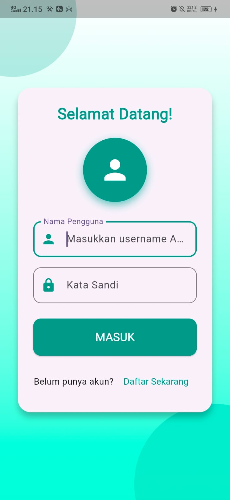  
   - Register  
     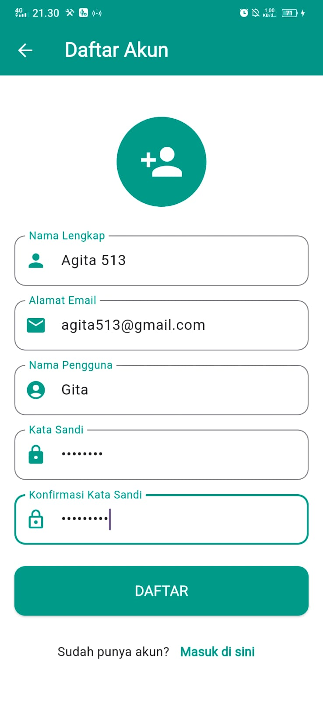

2. **Halaman Menu Utama**  
   

3. **Halaman Profil (Edit, Permission Untuk Foto Profil)**  
   - Edit Data Profil  
     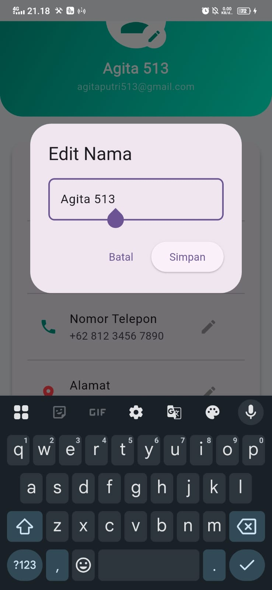  
   - Edit Foto Profil  
     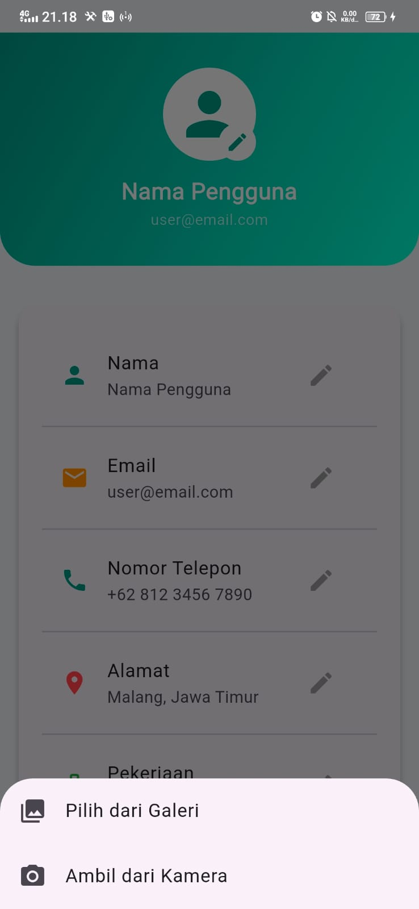  
   - Permission Kamera  
     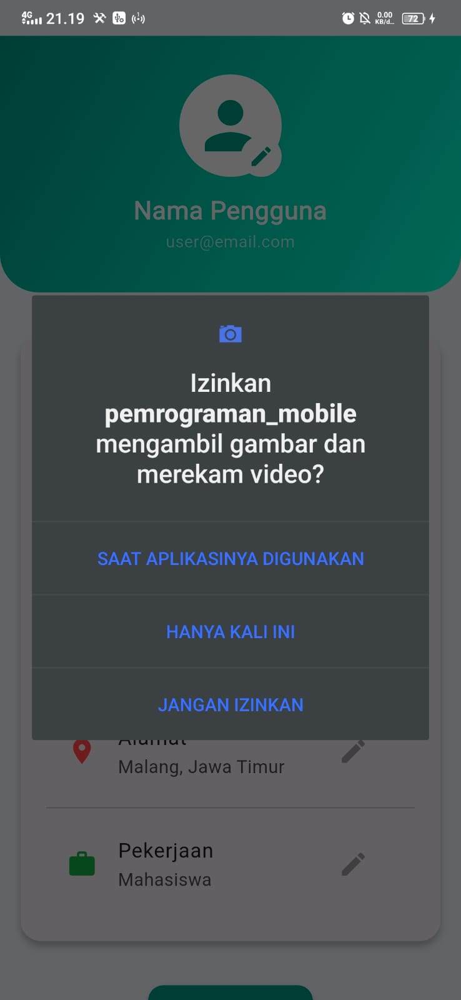

4. **Halaman Menu Manajer Pengeluaran**  
   - Daftar Pengeluaran  
       
   - Tambah Pengeluaran  
     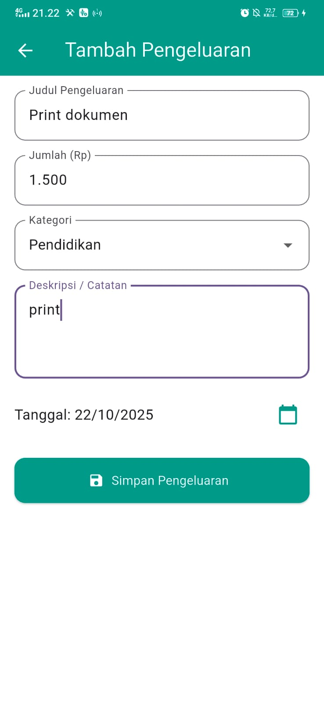  
   - Statistik Pengeluaran  
     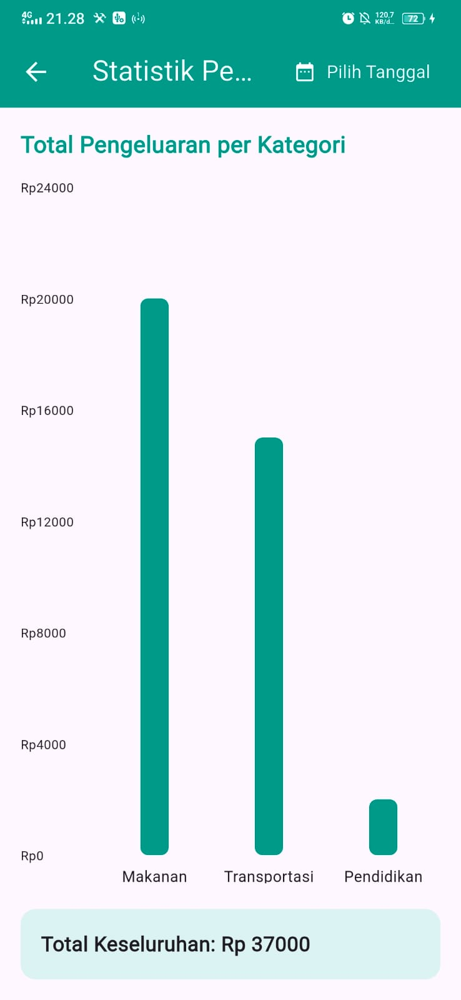  
   - Kelola Kategori  
     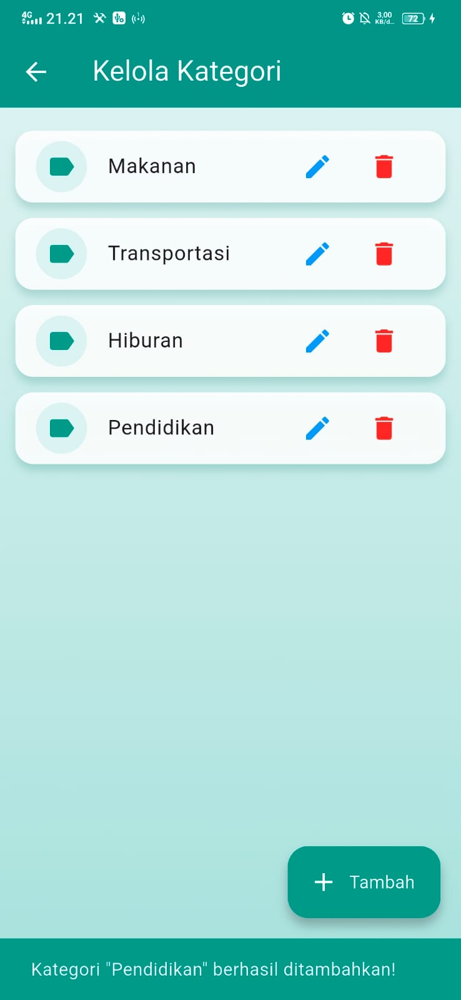

5. **Halaman Kelola Kategori (Edit, Hapus)**  
   - Edit Pengeluaran  
     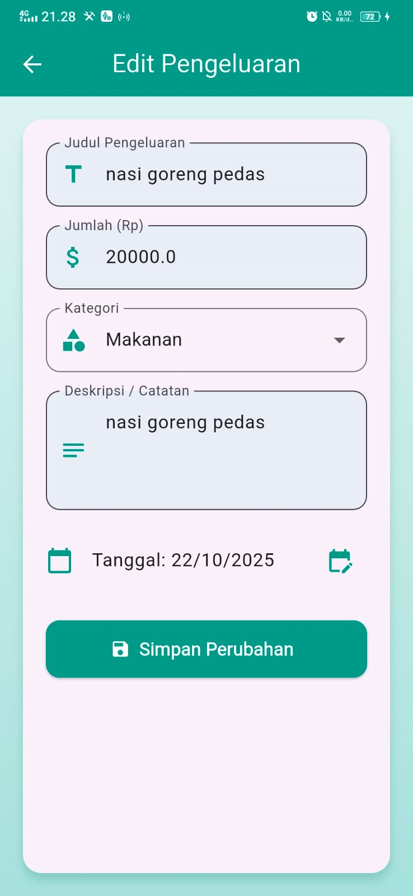

6. **Halaman Tambah Kategori**  
   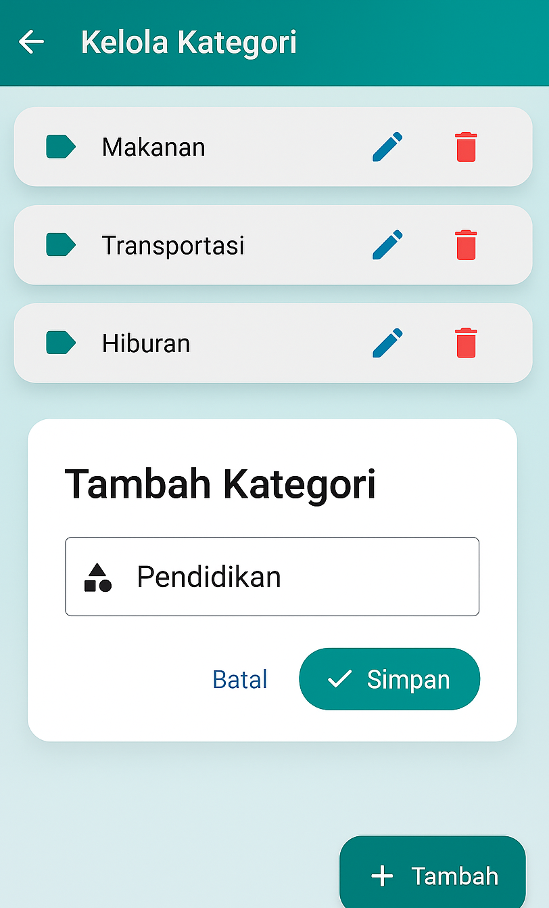

7. **Halaman Daftar Pengeluaran (Edit, Hapus)**  
   

8. **Halaman Statistik Pengeluaran (Pemilihan Tanggal)**  
   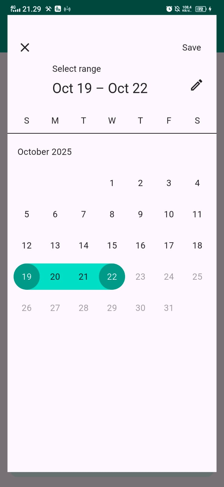

9. **Fitur Logout**  
   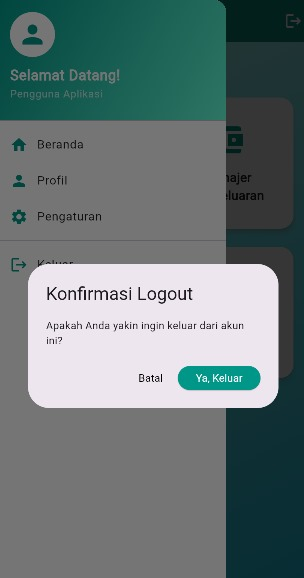

